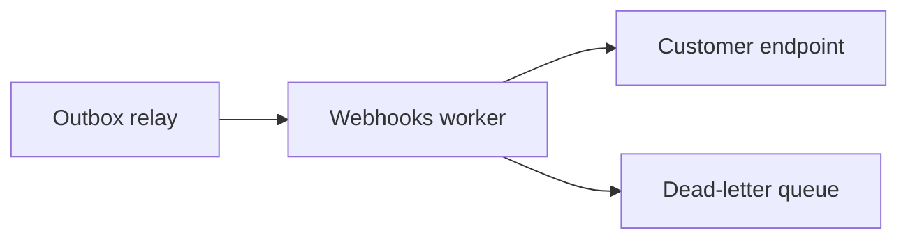

# archi

**An architect that knows your codebase.** Run `archi init` once to learn a repo,
then `archi design "<request>"` and archi will *interview you*, produce a design
grounded in your real modules and conventions, and — once you approve — **write the
code**.

```sh
cd my-service
archi init
archi design "add webhooks with retries and signature verification"
```

In a terminal, `archi design` is a conversation:

1. **It interviews you** — the 3–6 decision-critical questions first, each with a
   scenario for why it matters.
2. **It designs** — a grounded doc with Mermaid diagrams, streamed live.
3. **You decide** — `approve & build` · `modify` · `ask a question` · `write to file`.
4. **It builds** — on approval, it generates the actual files, shows a
   create/overwrite/delete summary, backs up anything it overwrites, and writes them.

Most "AI architect" tools design in a vacuum and hand you a generic diagram. `archi`
reads your actual repository first, so every plan — and every generated file —
references the patterns you already have.

---

## Why

Designing a change in a large or unfamiliar codebase means holding the whole thing in
your head: the stack, the module boundaries, the conventions, the data model. `archi`
does that reading once and caches it. After that, each design you ask for is decisive,
concrete, and *fits* — it names real paths, matches your existing patterns, and comes
with diagrams that render straight on GitHub.

## Features

- **Codebase-aware.** `init` scans the repo and caches a profile + file map in `.archi/`.
- **Interviews first.** Asks the decision-critical questions — with scenarios — before designing.
- **Grounded designs.** Plans reference your real directories, packages, and files.
- **Builds the code.** Approve a design and archi generates the files, with backups and a path guard.
- **Mermaid diagrams** that render on GitHub; `-html` renders them drawn in a browser.
- **Pluggable LLM backend.** Ollama Cloud (GLM) by default, or Anthropic (Claude).
- **Streaming, with a clean pipe.** Watch it work; redirect and you get pure Markdown.
- **Zero dependencies.** Pure Go standard library. One static binary.

## Install

```sh
go install github.com/devthedeveloper/archi@latest
```

Or build from source:

```sh
git clone https://github.com/devthedeveloper/archi
cd archi && go build -o archi .
```

## Setup

`archi` reads API keys from the environment — never from flags or files.

```sh
# Ollama Cloud (default provider)
export OLLAMA_API_KEY=...
# ...or point at a local Ollama and skip the key
export OLLAMA_HOST=http://localhost:11434

# Anthropic (use with -provider anthropic)
export ANTHROPIC_API_KEY=...
```

## Usage

```sh
archi init [path]              # learn a codebase (default: current dir)
archi design [flags] <request> # design a change against it
archi status                   # what archi has learned here
```

### `archi init`

| Flag | Default | Meaning |
|------|---------|---------|
| `-provider` | `ollama` | `ollama` or `anthropic` |
| `-model` | provider default | model id (`glm-4.6`, `claude-fable-5`, …) |
| `-force` | off | rebuild even if `.archi/` exists |
| `-max-file-kb` | `256` | skip files larger than this when sampling |

### `archi design`

In a terminal you get the full interview → design → review → build loop. Piped, or
with `-no-interactive`, it just prints the design (so it stays scriptable).

| Flag | Default | Meaning |
|------|---------|---------|
| `-focus <glob>` | — | include matching files as extra grounding (repeatable) |
| `-f <file>` | — | read the request from a file |
| `-o <file>` | stdout | write the design to a file |
| `-html <file>` | — | also render the design to a standalone HTML page (drawn diagrams) |
| `-no-interactive` | off | skip the interview and review loop |
| `-build` | off | after designing, generate the code (non-interactive) |
| `-yes` | off | auto-approve writing generated files |
| `-provider` / `-model` | from `.archi` | override the backend for this run |
| `-temp` | `0.4` | sampling temperature |
| `-max-tokens` | `8000` | max output tokens for the design |
| `-no-stream` | off | wait for the full response instead of streaming |

### Examples

```sh
archi init ./api                          # learn a subdirectory
archi design "make order processing idempotent"   # interview → design → build
archi design -focus 'internal/pay/**' "add refunds with partial-refund support"
archi design "add full-text search" -o docs/search-design.md -html docs/search.html
echo "add rate limiting per API key" | archi design    # piped: design only
archi design -no-interactive -build -yes "add a health check endpoint"  # scripted build
archi design -provider anthropic "shard the events table"
```

When archi builds, any file it overwrites is backed up to `<file>.bak`, and paths that
would escape the repo are refused.

## Sample output

`archi design` emits Markdown so the structure survives the paste, with Mermaid
diagrams grounded in your tree:

````markdown
## Summary
Add webhook delivery as a new `internal/webhooks` package driven off the existing
outbox, reusing the `pkg/httpx` client and the current worker pool — no new infra.

## Changes by area
| Area/Path | Change | Notes |
|---|---|---|
| internal/webhooks/ | new | delivery, signing, retry policy |
| internal/outbox/relay.go | modified | fan out webhook events |
| migrations/0042_webhooks.sql | new | endpoints + delivery_attempts |

## Diagrams

````

## How it works

- **`init`** — scans the repo (honoring `.gitignore`, skipping binaries), writes a
  deterministic `map.md`, sends the key files to the model, and caches its
  understanding as `profile.md` in `.archi/`.
- **`design`** — loads the profile + map (plus any `-focus` files) as grounding, then
  runs the interview, design, review, and build phases against that context. Building
  parses the model's file blocks and writes them under the repo root.

No magic, no lock-in: the cache is plain Markdown you can read and edit, and generated
code is written straight to disk with a `.bak` for anything overwritten.

## License

MIT — see [LICENSE](LICENSE).
