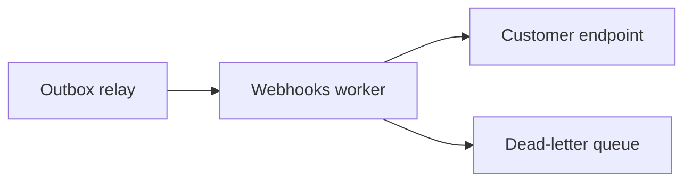

# archi

**An architect that knows your codebase.** Run `archi init` once to learn a repo,
then `archi design "<request>"` and archi will *interview you*, produce a design
grounded in your real modules and conventions, and — once you approve — **write the
code**.

```sh
cd my-service
archi init
archi design "add webhooks with retries and signature verification"
```

In a terminal, `archi design` is a conversation:

1. **It interviews you** — the 3–6 decision-critical questions first, each with a
   scenario for why it matters.
2. **It designs** — a grounded doc with Mermaid diagrams, streamed live.
3. **You decide** — `approve & build` · `modify` · `ask a question` · `write to file`.
4. **It builds** — on approval, it generates the actual files, shows a
   create/overwrite/delete summary with a colored unified diff for every overwrite,
   backs up the originals, and writes them.

Most "AI architect" tools design in a vacuum and hand you a generic diagram. `archi`
reads your actual repository first, so every plan — and every generated file —
references the patterns you already have.

---

## Why

Designing a change in a large or unfamiliar codebase means holding the whole thing in
your head: the stack, the module boundaries, the conventions, the data model. `archi`
does that reading once and caches it. After that, each design you ask for is decisive,
concrete, and *fits* — it names real paths, matches your existing patterns, and comes
with diagrams that render straight on GitHub.

## Features

- **Codebase-aware.** `init` scans the repo and caches a profile + file map in `.archi/`.
- **Stays current.** A repo fingerprint detects drift — `design` and `status` warn
  when the cache is stale, and `init -refresh` updates it from only what changed.
- **Interviews first.** Asks the decision-critical questions — with scenarios — before designing.
- **Grounded designs.** Plans reference your real directories, packages, and files.
- **Builds the code.** Approve a design and archi generates the files, with diff
  previews, versioned backups, and a path guard.
- **Design history.** Every design is saved under `.archi/designs/`;
  `archi status` lists the most recent ones and whether they were built.
- **Secrets stay home.** Likely credentials are redacted to `[REDACTED]` before any
  file content is sent, and obvious secret files are never scanned at all.
- **Mermaid diagrams** that render on GitHub; `-html` renders them drawn in a browser.
- **Pluggable LLM backend.** Ollama Cloud (GLM) by default, Anthropic (Claude), or any
  OpenAI-compatible API (OpenAI, OpenRouter, Groq, local servers).
- **Streaming, with a clean pipe.** Watch it work; redirect and you get pure Markdown.
- **Zero dependencies.** Pure Go standard library. One static binary.

## Install

**Prebuilt binaries** — grab the archive for your platform from the
[releases page](https://github.com/devthedeveloper/archi/releases), unpack it,
and put `archi` on your `PATH`. Linux, macOS, and Windows, amd64 + arm64.

**With Go:**

```sh
go install github.com/devthedeveloper/archi@latest
```

**From source:**

```sh
git clone https://github.com/devthedeveloper/archi
cd archi && go build -o archi .
```

## Setup

`archi` reads API keys from the environment — never from flags or files.

```sh
# Ollama Cloud (default provider)
export OLLAMA_API_KEY=...
# ...or point at a local Ollama and skip the key
export OLLAMA_HOST=http://localhost:11434

# Anthropic (use with -provider anthropic)
export ANTHROPIC_API_KEY=...

# OpenAI (use with -provider openai)
export OPENAI_API_KEY=...
# ...or any OpenAI-compatible API — OpenRouter, Groq, vLLM, llama.cpp, ...
export OPENAI_BASE_URL=https://openrouter.ai/api/v1   # default: https://api.openai.com/v1
```

### Timeouts & retries

Transient failures — HTTP 429, 5xx, and network errors — are retried up to 3 times
with exponential backoff and jitter, honoring the server's `Retry-After` header
(capped at 30s). Retries never re-request a stream that has already started.

There is no overall request timeout by default (long streamed designs are normal),
but connecting and waiting for response headers time out after ~60s so a dead
server fails fast. To cap the whole request, streaming included, set:

```sh
export ARCHI_TIMEOUT=10m   # any Go duration string, e.g. 90s, 10m
```

## Usage

```sh
archi init [path]              # learn a codebase (default: current dir)
archi design [flags] <request> # design a change against it
archi status                   # what archi has learned here
archi serve [-root <path>]     # expose archi as MCP tools for agent clients
```

### `archi init`

| Flag | Default | Meaning |
|------|---------|---------|
| `-provider` | `ollama` | `ollama`, `anthropic`, or `openai` |
| `-model` | provider default | model id (`glm-5.2:cloud`, `claude-fable-5`, `gpt-5.2`, …) |
| `-force` | off | rebuild even if `.archi/` exists |
| `-refresh` | off | update an existing cache incrementally from what changed |
| `-max-file-kb` | `256` | skip files larger than this when sampling |

`init` also writes `.archi/fingerprint` — one `hash  path` line per scanned file,
hashing path + size + mtime — so archi can later tell, from stats alone, whether the
repo has drifted from the cache.

`archi init -refresh` rescans, diffs against that fingerprint, regenerates `map.md`
deterministically, and asks the model to *revise* the existing profile from only the
added and modified files (redacted like any other sample) — much cheaper than a full
rebuild. It keeps the provider/model the cache was built with unless you override
them, and if more than 40% of the fingerprinted files were touched it falls back to
a full rebuild automatically. `-force` still means a full rebuild.

### `archi design`

In a terminal you get the full interview → design → review → build loop. Piped, or
with `-no-interactive`, it just prints the design (so it stays scriptable).

| Flag | Default | Meaning |
|------|---------|---------|
| `-focus <glob>` | — | include matching files as extra grounding (repeatable) |
| `-f <file>` | — | read the request from a file |
| `-o <file>` | stdout | write the design to a file |
| `-html <file>` | — | also render the design to a standalone HTML page (drawn diagrams) |
| `-no-interactive` | off | skip the interview and review loop |
| `-build` | off | after designing, generate the code (non-interactive) |
| `-yes` | off | auto-approve writing generated files |
| `-provider` / `-model` | from `.archi` | override the backend for this run |
| `-temp` | `0.4` | sampling temperature |
| `-max-tokens` | `8000` | max output tokens for the design |
| `-no-stream` | off | wait for the full response instead of streaming |

If the repo has changed since `init`, `design` warns — e.g.
`repo has changed since init: 12 files added/modified, 3 removed — consider archi
init -refresh` — and continues with the cached understanding.

The grounding context (profile + map + focus files) is capped at ~48k tokens: the
profile always ships whole, the file map is head-truncated if it must be, and focus
files are included in order until the budget runs out — anything truncated or
dropped is named in a warning. Raise or lower the cap with:

```sh
export ARCHI_CONTEXT_TOKENS=96000
```

### `archi status`

Shows what archi has learned: provider, language breakdown, recent designs, and a
**freshness** line — `fresh` when the repo still matches the fingerprint, or the
drift summary (`12 files added/modified, 3 removed`) with a nudge to
`archi init -refresh`, plus the age of the cache.

### Examples

```sh
archi init ./api                          # learn a subdirectory
archi design "make order processing idempotent"   # interview → design → build
archi design -focus 'internal/pay/**' "add refunds with partial-refund support"
archi design "add full-text search" -o docs/search-design.md -html docs/search.html
echo "add rate limiting per API key" | archi design    # piped: design only
archi design -no-interactive -build -yes "add a health check endpoint"  # scripted build
archi design -provider anthropic "shard the events table"
```

When archi builds, the proposed-changes preview shows a unified diff for every file
it would overwrite (capped at ~200 lines per file) before asking for confirmation,
and it warns — without blocking — if the repo has uncommitted git changes. Every
file it overwrites or deletes is first copied to `.archi/backups/<timestamp>/`,
preserving relative paths, with a `manifest.txt` listing the run's files; the 10
most recent backup runs are kept. Paths that would escape the repo are refused.

Each design is also saved to `.archi/designs/<timestamp>-<slug>.md` with a small
header (request, provider, date, and whether it was built) — `archi status` shows
the last five.

## MCP

`archi serve` runs archi as a [Model Context Protocol](https://modelcontextprotocol.io) server
over stdio, so agent clients — Claude Code, Claude Desktop/Cowork, Cursor — can call it as
tools: `archi_status`, `archi_init`, `archi_design`, `archi_build`, `archi_review`, and
`archi_rollback`. Every tool call is confined to the `-root` directory (default: the working
directory at launch). `archi_build` is a dry run unless `dry_run:false` is passed, and real
writes are refused while the repo has uncommitted changes unless `allow_dirty:true` — stricter
than the CLI, since there is no human at a confirm prompt.

Claude Code:

```sh
claude mcp add archi -- archi serve -root "$(pwd)"
# provider keys come from your shell env, e.g. export ANTHROPIC_API_KEY=…
```

Claude Desktop / Cowork (`claude_desktop_config.json`):

```json
{"mcpServers": {"archi": {
  "command": "archi",
  "args": ["serve", "-root", "/abs/path/to/repo"],
  "env": {"OLLAMA_API_KEY": "…", "ARCHI_TIMEOUT": "10m"}}}}
```

Generic project-scoped `.mcp.json` (Claude Code, Cursor):

```json
{"mcpServers": {"archi": {"command": "archi", "args": ["serve"],
  "env": {"ARCHI_TIMEOUT": "10m"}}}}
```

No `-root` means the working directory, which project-scoped clients set to the repo. Provider
keys are read from the server's environment only — they never cross the MCP wire — and
`ARCHI_TIMEOUT` caps every tool call, streaming included. stdout carries protocol JSON only;
progress and logging go to stderr.

## GitHub App

`archi-app` (its own zero-dep module under [`app/`](app/)) brings archi to teams: a webhook
service that runs the CLI in per-job workspace clones and posts results back to GitHub.
Comment on an issue or PR (write access required; the 👀 reaction is the ack):

| Comment | Result |
|---|---|
| `/archi design <request>` | the design, posted as a comment |
| `/archi design --pr <request>` | a **draft PR** with `docs/designs/<slug>.md` on an `archi/design-*` branch |
| `/archi build` | on that design PR: generated code pushed to the same branch |
| `/archi review` | a PR review from the critic panel + an "archi review" check run |

With `auto_review: true` in `.github/archi.yml`, every PR open/synchronize gets a review check
run automatically (fork PRs are reviewed from the API diff — fork code is never checked out, and
`/archi build` never runs on forks). Per-repo config is a flat `key: value` file:

```yaml
# .github/archi.yml
provider: anthropic       # ollama | anthropic | openai
model: claude-fable-5
critic_model: claude-haiku-4-5
agents: full              # full | fast
auto_review: true
max_tokens: 12000
```

Deploy `archi-app serve` (Dockerfile included — needs `git`, the `archi` binary, and a volume
for the `.archi` cache at `CACHE_DIR`). Required env: `APP_ID`, `WEBHOOK_SECRET`, and
`PRIVATE_KEY_PATH` or `PRIVATE_KEY_BASE64`; provider API keys are forwarded only to CLI child
processes. Tunables: `ARCHI_BIN`, `CACHE_DIR`, `WORK_DIR`, `WORKERS`, `QUEUE_SIZE`,
`MAX_JOBS_PER_HOUR`, `JOB_TIMEOUT` (also exported to the CLI as `ARCHI_TIMEOUT`). The GitHub App
needs `contents: write`, `issues: write`, `pull_requests: write`, `checks: write`,
`metadata: read`, and the `issue_comment`, `pull_request`, `issues`, `installation` events, with
the webhook pointed at `https://<your-host>/webhook`.

## Sample output

`archi design` emits Markdown so the structure survives the paste, with Mermaid
diagrams grounded in your tree:

````markdown
## Summary
Add webhook delivery as a new `internal/webhooks` package driven off the existing
outbox, reusing the `pkg/httpx` client and the current worker pool — no new infra.

## Changes by area
| Area/Path | Change | Notes |
|---|---|---|
| internal/webhooks/ | new | delivery, signing, retry policy |
| internal/outbox/relay.go | modified | fan out webhook events |
| migrations/0042_webhooks.sql | new | endpoints + delivery_attempts |

## Diagrams

````

## How it works

- **`init`** — scans the repo (honoring `.gitignore` files, skipping binaries and
  secret files), writes a deterministic `map.md`, sends the key files to the model,
  caches its understanding as `profile.md` in `.archi/`, and fingerprints every
  scanned file (path + size + mtime) so later runs can detect drift with stats alone.
  `-refresh` updates the profile from just the files that changed.
- **`design`** — loads the profile + map (plus any `-focus` files) as grounding,
  warns if the repo drifted from the cache, fits everything into the context budget
  (`ARCHI_CONTEXT_TOKENS`, default ~48k), then runs the interview, design, review,
  and build phases against that context. Building parses the model's file blocks and
  writes them under the repo root.

### Secrets & ignore rules

`archi` never sends obvious secret files: `.env`, `.env.*`, `*.pem`, `*.key`, and
`id_rsa*` are excluded from the scan entirely. Every file that *is* sent — `init`'s
key files and `-focus` files — passes through a redactor first, which replaces
likely credentials (AWS access/secret keys, GitHub / Slack / Stripe tokens, private
key blocks, `Bearer` headers, and `api_key/secret/token/password = <long value>`
assignments) with `[REDACTED]` and prints a warning naming each file it touched.

`.gitignore` handling follows git semantics: nested `.gitignore` files in
subdirectories apply only to paths under their own directory, and deeper files take
precedence — including `!` negations.

No magic, no lock-in: the cache is plain Markdown you can read and edit, generated
code is written straight to disk, and anything overwritten is kept in
`.archi/backups/` for the last 10 runs.

## License

MIT — see [LICENSE](LICENSE).
